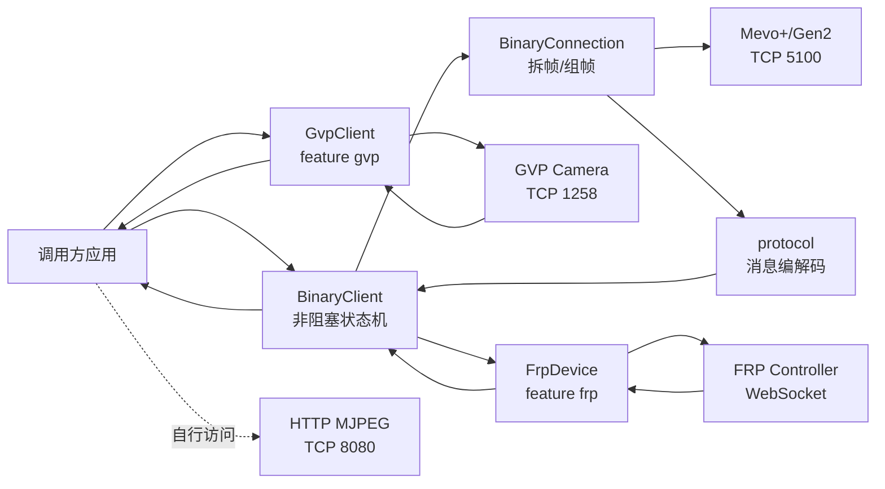

# ironsight 项目分析报告

> 分析日期：2026-09-15
>
> 分析范围：项目内全部 Rust 源码、示例、测试夹具、协议文档、Cargo 配置、Makefile、CI/Release 工作流和许可证文件；不包含 `.git/` 元数据与未生成的 `target/` 构建目录。

## 1. 项目概述

`ironsight` 是一个用 Rust 编写的 FlightScope Mevo+ / Mevo Gen2 非官方协议库，当前 crate 版本为 `0.2.2`。它通过逆向得到的本地网络协议直接与设备通信，覆盖三条相互独立的数据通道：

| 通道 | 默认端口 | 项目组件 | 主要用途 |
|---|---:|---|---|
| Mevo 二进制协议 | TCP `5100` | `BinaryClient`、`BinaryConnection` | 握手、配置、Arm、Keepalive、球和杆头雷达数据 |
| GVP JSON 协议 | TCP `1258` | `GvpClient`，需 `gvp` feature | 相机配置、触发、逐帧物体跟踪结果、视频完成通知 |
| Flight Relay Protocol | WebSocket `5880`（默认） | `FrpDevice`，需 `frp` feature | 把部分 Mevo 击球摘要转发给通用 FRP Controller |

设备的 `8080` 端口还提供标准 HTTP MJPEG 视频流；项目对其协议进行了文档说明，但没有实现专门的 MJPEG 客户端。

这个项目不是最终用户 App，也不负责训练记录、数据库、图表或球场模拟。它的角色是底层设备接入与协议解析库：把网络字节转换为 Rust 数据结构，并提供状态机帮助调用方正确完成设备生命周期。

## 2. 项目目的与价值

项目解决的是官方未公开 SDK 情况下的第三方互操作问题。其主要价值为：

1. **直接连接硬件**：应用可在连接 Mevo+ Wi-Fi 后直接访问 `192.168.2.1:5100`，无需让官方 App 中转。
2. **完整协议层**：不只解析常见球速、起飞角和 Carry，还覆盖握手、设备信息、状态、校准、相机、原始雷达跟踪点和杆头数据。
3. **同时支持两代设备**：通过 DSP Query 的 `dsp_type` 区分 Mevo+ Gen1（`0x80`）和 Mevo Gen2（`0xC0`）。
4. **非阻塞事件模型**：`BinaryClient::poll()` 和 `GvpClient::poll()` 可嵌入游戏、桌面程序或自有事件循环，不依赖 Tokio 等异步运行时。
5. **支持底层研究**：公开消息枚举、帧解析器、序列器和原始测量字段，适合调试协议或开发自己的轨迹/融合算法。
6. **可接入标准中间层**：可选 FRP 适配器让设备以 Flight Relay Protocol Device 身份被控制器发现和消费。

项目明确声明与 FlightScope 无关联，并把用途限定为合法设备的互操作，不用于绕过订阅、Pro Package、Fusion Tracking 或其他授权限制。

## 3. 技术栈与构建配置

### 3.1 核心技术

| 类别 | 技术/版本 | 用途 |
|---|---|---|
| 开发语言 | Rust 2024 Edition | 协议、网络和状态机实现 |
| 最低 Rust | `1.94` | 由 `rust-version` 和 `rust-toolchain.toml` 固定 |
| 错误处理 | `thiserror 2` | `WireError`、`ConnError`、`GvpError` |
| 序列化 | 可选 `serde 1` | 部分雷达结果结构的序列化 |
| JSON | 可选 `serde_json 1` | GVP 消息编码与解码 |
| FRP | 可选 `flightrelay 0.2.1` | WebSocket FRP Device 适配 |
| 网络模型 | 标准库 `TcpStream`、`Read + Write` | 同步 I/O，外层以非阻塞轮询运行 |

项目刻意保持轻量：默认构建只有 `thiserror`，没有异步运行时、日志框架或大型网络框架。

### 3.2 Cargo features

| Feature | 引入内容 | 实际效果 |
|---|---|---|
| 默认 | 无额外 feature | 二进制协议和状态机 |
| `serde` | `serde` | 为 `FlightResult`、`FlightResultV1`、`ClubResult`、`SpinResult` 等部分类型增加 `Serialize` |
| `gvp` | `serde`、`serde_json` | 编译 GVP 相机 JSON 客户端和消息类型 |
| `frp` | `flightrelay` | 编译 `FrpDevice` 和 `ironsight-frp` 可执行程序 |

`gvp` 和 `frp` 互不依赖，可以单独或同时启用。

### 3.3 许可证与发布

- 双许可证：MIT 或 Apache-2.0；
- `NOTICE` 标明 FlightScope、Mevo 商标归原权利人；
- `Cargo.lock` 被忽略，这对纯库常见，但仓库同时发布可执行文件时会降低二进制构建的依赖可复现性；
- `docs/` 被 `Cargo.toml` 的 package `exclude` 排除，crates.io 包内不会包含三份详细协议文档。

## 4. 总体架构



可以把代码理解为五层：

1. `codec.rs`：基础数值格式；
2. `frame.rs`：线协议帧、转义和校验；
3. `protocol/`：命令、响应及字段结构；
4. `conn.rs`、`seq.rs`、`client.rs`：连接、操作状态机和事件 API；
5. `gvp/`、`frp/`：相机扩展和上游协议桥。

## 5. 二进制协议实现

### 5.1 帧格式

二进制协议使用以下逻辑帧：

```text
F0 | DEST | SRC | TYPE | PAYLOAD... | CHECKSUM(2B) | F1
```

- `0xF0`：帧起始；
- `0xF1`：帧结束；
- `DEST` / `SRC`：总线目的和来源；
- `TYPE`：消息类型；
- Checksum：对转义后的帧内容进行 16 位求和；
- `F0`、`F1`、`FD`、`FA` 等保留字节通过 byte stuffing 转义；
- 多字节字段为大端序。

`FrameSplitter` 能处理 TCP 粘包、半包和流中的连续多帧，`RawFrame` 负责校验、去转义和重新编码。

### 5.2 特殊数值编码

协议层实现了：

- 有符号 `INT16`；
- 有符号/无符号 `INT24`；
- `INT32`；
- 设备专用 `FLOAT40`；
- 各字段固定比例缩放，如 `/100`、`/1000`、`/100000`。

原始协议单位主要使用米、米/秒、度和 RPM。显示为 mph、yard、feet、inch 的转换只出现在示例层，不改变库内数据。

### 5.3 总线节点

| 节点 | 地址 | 职责 |
|---|---:|---|
| APP | `0x10` | 本库代表的客户端 |
| PI | `0x12` | 设备内置计算单元、相机、Wi-Fi、许可相关功能 |
| AVR | `0x30` | 雷达 I/O、倾角、电池和击球结果 |
| DSP | `0x40` | 雷达信号处理、设备状态和飞行计算 |

未知消息不会直接报错，而是保存为 `Message::Unknown { type_id, src, payload }`，便于兼容新固件和继续逆向。

## 6. 连接、配置与击球状态机

### 6.1 高层 `BinaryClient`

`BinaryClient<S>` 可包装任意 `Read + Write` 流。对于 TCP，应使用 `BinaryClient::from_tcp()`，它会自动设为 non-blocking；如果给 `new()` 传入阻塞流，`poll()` 会卡住，无法及时处理超时和 Keepalive。

公开操作按 FIFO 串行执行：

```text
handshake → configure_avr → configure_cam → arm → shot loop
```

主要事件为：

| 事件 | 含义 |
|---|---|
| `Handshake` | DSP、AVR、PI 三阶段同步完成 |
| `Disarmed` | 配置前自动或显式解除 Arm |
| `Configured` | AVR 或 Camera 配置完成 |
| `Armed` | 设备已准备检测击球 |
| `Trigger` | 收到 `BALL TRIGGER` |
| `ShotDatum` | 飞行、早期飞行、杆头或旋转的实时单项结果 |
| `ShotComplete` | 本轮后处理和重新 Arm 完成，附带累计数据 |
| `Keepalive` | 三节点状态轮询完成 |
| `Message` | 未被当前状态机消费的公开原始消息 |

### 6.2 Handshake

握手依次执行：

1. DSP：状态、硬件类型、固件、产品信息和雷达参数；
2. AVR：状态、设备信息、参数、工厂校准和时间同步；
3. PI：状态、设备信息、相机配置、网络参数和能力标志。

文档记录的正常总时长约 1.2 秒，带重试约 3.8 秒。设备已处于 Armed 状态时，客户端会识别 DSP state，并在下一次重新配置前自动 Disarm。

### 6.3 Keepalive 与超时

- Arm 后默认每 1 秒轮询 DSP、AVR、PI；
- 普通操作默认 30 秒超时；
- Keepalive 固定 3 秒超时，失败不会立即终止会话；
- Trigger 后 30 秒仍未收到 `PROCESSED` 会报 Timeout，要求上层重连；
- 收到主 FlightResult 后若 3 秒仍无 `IDLE`：默认模式直接尝试重新 Arm；启用主动分页时先探测杆头 PRC 第 0 页，再重新 Arm。

### 6.4 击球结束流程

收到 `PROCESSED` 后，`ShotSequencer`：

1. 发送两次 `ShotDataAck (0x69)`；
2. 启用主动分页时，从索引 0 逐页请求球 `PrcData (0xEC)`；
3. 在 Drain 阶段收集后续结果，直到 `IDLE`；
4. 发送 `ShotResultReq (0x6D)`，最多等待重复的 `ClubResult` 1 秒；
5. 启用主动分页时逐页请求 `ClubPrc (0xEE)`；即使重复 ClubResult 或 IDLE 缺失，也会从第 0 页进行一次探测；
6. 发送 Arm 命令；
7. 等待 ConfigAck 和 `ARMED` 文本；
8. 产生带 `PrcFetchStatus` 的 `ShotComplete`。

代码特意不把 ModeAck / ConfigResp 作为硬性门槛，以兼容 Gen1 与 Gen2 不同的消息顺序。

## 7. 能读取的击球数据

### 7.1 主球飞行结果 `FlightResult (0xD4)`

每杆的主结果包含：

| 类别 | 字段 |
|---|---|
| 编号与跟踪 | shot counter、track time |
| 起点 | 三维 `start_position`：前向、垂直、横向 |
| 初始状态 | launch speed、launch azimuth/HLA、launch elevation/VLA |
| 空中结果 | carry distance、flight time、maximum height |
| 落地状态 | 三维 landing position、三维 landing velocity、三轴 landing spin |
| 旋转 | backspin、sidespin、riflespin |
| 杆头摘要 | clubhead speed、post-impact speed、path、attack angle、swing plane、effective loft、face angle |
| 连续轨迹模型 | `poly_x[5]`、`poly_y[5]`、`poly_z[5]` |
| 当前不可信字段 | total distance、roll distance、final position |

轨迹多项式为每轴 5 个系数，即数学上的**四次多项式**：

```text
position(t) = c0 + c1·t + c2·t² + c3·t³ + c4·t⁴
```

源代码和部分文档把“五个系数”写成 “5th-order”，但公式最高次项是 `t⁴`，准确说法应是四次多项式。

### 7.2 早期结果 `FlightResultV1 (0xE8)`

它通常在最终 D4 前到达，可用于更快启动画面或物理模拟，包含：

- ball velocity、club velocity；
- flight time、distance、height、lateral；
- elevation、azimuth；
- tracked time、drag、acceleration；
- backspin、sidespin；
- club strike direction；
- 同样的 X/Y/Z 五系数轨迹模型。

它通过 `ShotDatum::FlightV1` 实时发出，但**不会存入最终 `ShotData`**，调用者要在事件到达时自行保存。

### 7.3 杆头结果 `ClubResult (0xED)`

包含：

- 撞击前/后的杆头速度；
- club path / strike direction；
- attack angle；
- face angle；
- dynamic loft；
- smash factor；
- swing plane horizontal / vertical；
- club azimuth / elevation；
- club offset / height；
- 撞击前后位置、速度及 Y/X、Z/X 比值的 12 组三系数多项式；
- pre-impact、post-impact、club-to-ball timing。

设备通常每杆发送两份字节相同的 ClubResult。

### 7.4 旋转结果 `SpinResult (0xEF)`

除最终总旋转 `pm_spin_final` 和 spin axis 外，还包含：

- 5 组天线 × 3 个距离 bin 的 spin、peak、SNR；
- PM raw、PM、AM、AOD、PLL、launch 和 lift spin；
- 置信度、验证上下限、算法选择和 flags。

因此项目不只是读取一个 “total spin” 数字，还保留了多个算法和天线层面的诊断信息。

### 7.5 杆头速度曲线 `SpeedProfile (0xD9)`

这是时间序列，而不是单个杆速值：

- 通常有 36–45 个撞击前样本；
- 通常有 18–38 个撞击后样本；
- 采样间隔约 `853 µs`，即约 `1.17 kHz`；
- 每个样本是已经缩放为 m/s 的杆头速度；
- 设备有时发送只有 2 字节的空 stub，代码会正常解析为空曲线。

### 7.6 TrackingStatus 与文本/相机通知

还可解析：

- 雷达处理阶段、结果质量、trigger index、club impact index、PRC 点数；
- `BALL TRIGGER`、`Clubimpact`、`PROCESSED`、`IDLE` 文本；
- 相机图片/流/Fusion/视频是否可用；
- DSP、AVR、PI 状态、电量、外接电源、温度、倾角和横滚角。

## 8. 轨迹数据专项结论

### 8.1 结论先行

**该项目有能力读取并向调用方暴露真实的轨迹相关数据，不是只能导出击球初始状态和落地状态。**

它能提供四种不同层次的“轨迹”：

| 数据层次 | 来源 | 内容 | 是否是真实逐点 3D 坐标 |
|---|---|---|---|
| 原始球雷达点 | `PrcData (0xEC)` | 时间、方位角、仰角、径向速度、距离、SNR、天线角度和峰值 | 不是直接笛卡尔坐标，但是真实逐点雷达测量，可转换为 3D 点 |
| DSP 球轨迹模型 | D4/E8 的 `poly_x/y/z` | 随时间连续求值的 X/Y/Z 多项式 | 是连续 3D 模型，不是离散原始点 |
| 原始杆头雷达点 | `ClubPrc (0xEE)` | 击球前后时间偏移、角度、速度、距离、SNR 和天线数据 | 同样是极坐标式逐点雷达测量 |
| 相机跟踪点 | GVP `RESULT` | frame、timestamp、u/v、radius、circularity、shutter | 仅二维像素点，不是 3D 世界坐标 |

因此，如果“轨迹点”是指设备每次雷达采样得到的观测点，答案是**可以读取 `PrcData` 和 `ClubPrc`**；如果是指可直接画出的连续三维弹道，答案是**可以通过 D4/E8 的多项式在任意时间采样生成 X/Y/Z 点**。

### 8.2 球的原始雷达跟踪点 `PrcData (0xEC)`

一个 `PrcPoint` 包含：

- `index`、`buf_idx`、`flags`；
- 时间计数 `time`，约 `26.7 µs/count`；
- 方位角 `az`、仰角 `el`；
- 径向速度 `vel`；
- 距离 `dist`；
- `snr`、主 peak；
- 三路单独方位角 `az1/az2/az3`；
- 两路单独仰角 `el1/el2`；
- 六路天线峰值 `pk[6]`；
- 同步索引和折射率相关因子。

文档记录每杆典型约 46–112 点；近距离点间隔约 0.853 ms，远距离约 3.4 ms。`vel` 是视线方向径向速度，通常会略小于 D4 给出的总球速。

它不是 `[x,y,z]` 数组，但可以根据 `dist + az + el` 转换为笛卡尔坐标，并以 `time` 排序形成离散三维雷达轨迹。坐标方向和符号转换必须按 `docs/WIRE.md` 的 DSP-to-PC 规则处理。

### 8.3 DSP 连续轨迹多项式

D4 和 E8 都直接公开 `poly_x`、`poly_y`、`poly_z`。其中：

- X = 前向/距离方向；
- Y = 垂直方向；
- Z = 横向方向；
- 给定时间 `t` 后，可分别计算三轴位置；
- 调用方可按 10 ms、16.7 ms 或任意时间步长生成动画轨迹点。

这是设备/DSP 输出的拟合模型，不能与原始 PRC 测量点混为一谈。它更适合平滑动画和快速回放，PRC 更适合信号分析、重新拟合与算法研究。

### 8.4 杆头雷达轨迹 `ClubPrc (0xEE)`

每个点包含：

- 相对触发点的 `buf_ofs`，负值代表撞击前、正值代表撞击后；
- time、azimuth、elevation；
- 两组 velocity；
- distance、SNR、peak；
- 分天线角度与峰值。

`ClubResult` 另有撞击前/后杆头位置和速度的二次多项式，可得到平滑杆头路径；`SpeedProfile` 则提供更高时间分辨率的标量速度曲线。

### 8.5 GVP 相机轨迹

`BallTrackerResult` 中每条 `Track` 使用平行数组保存：

- `frame_number[]`；
- `timestamp[]`；
- `u[]`、`v[]` 像素坐标；
- `radius[]`；
- `circularity_factor[]`；
- `shutter_time_ms[]`。

`track_id = 0` 为球，`track_id = 1` 为杆头，`2–4` 是参考点。测试夹具中的真实 pcap 样本有约 10 个球点、15 个杆头点。

这些是相机传感器平面的二维观测，**不能直接当作三维球路**。要得到三维或杆面撞击位置，需要使用相机标定、雷达轨迹和坐标变换做融合。

### 8.6 Face Impact 能力

项目没有某个消息能直接返回 `faceImpactX/faceImpactY`。文档和代码都明确：Face Impact 必须由客户端融合计算，输入至少包括：

1. `PrcData` 球雷达点；
2. `ClubPrc` 杆头雷达点；
3. GVP 球/杆头二维像素 tracks；
4. 二进制 `CAM_PARAM_RESP` 的相机标定；
5. 用户的高度和横向校准偏移。

仓库中的 `gvp_testing.rs` 会从雷达多项式生成 GVP 的 Expected Track 提示并打印跟踪结果，但它仍是 smoke test/研究示例，**没有实现最终 Face Impact 解算算法，也没有输出杆面二维撞击点**。

### 8.7 落地与滚动的边界

D4 确实有：

- `landing_position`；
- `landing_velocity`；
- `landing_spin_rpm`；
- `carry_distance`、`flight_time`、`max_height`。

但以下字段不能按名称直接信任：

- `total_distance`：实测包含诊断值，甚至可能为负；
- `roll_distance`：线上的实测值总为零；
- `final_position`：实测为 `(0,0,0)`。

也就是说，项目能给出飞行落地点和落地状态，但**不能直接提供可靠的滚动后最终位置**。总距离和滚动需要调用方结合落地速度、落地旋转、地面硬度、坡度和摩擦模型计算。

## 9. “能读取”与“能直接导出”的区别

核心 crate 仍然是协议库，不包含通用数据库或 Parquet writer；但本次已经新增 `examples/raw_point_export.rs`，可直接把每杆雷达和相机原始点导出为本地 CSV/JSON。

### 9.1 公共 API 可取得的数据

- `Message::PrcData` / `ShotData.prc`：球雷达点；
- `Message::ClubPrc` / `ShotData.club_prc`：杆头雷达点；
- `FlightResult.poly_x/y/z`：最终球轨迹模型；
- `ShotDatum::FlightV1`：早期球轨迹模型；
- `ShotData.speed_profile`：杆头速度时间序列；
- `GvpEvent::Result`：相机二维跟踪点。

新增示例已经同时消费以上事件并完成 CSV/JSON 落盘；其他应用仍可通过这些公共 API 自行实现 Parquet 或数据库导出。

### 9.2 当前 serde 覆盖范围

启用 `serde` 后可直接序列化的击球结构主要是：

- `FlightResult`；
- `FlightResultV1`；
- `ClubResult`；
- `SpinResult` 及天线项。

当前没有为以下类型派生 `Serialize`：

- `ShotData`；
- `SpeedProfile`；
- `TrackingStatus`；
- `PrcData` / `PrcPoint`；
- `ClubPrc` / `ClubPrcPoint`。

所以轨迹多项式在显式启用 `serde` feature 时可随 `FlightResult` 序列化，而原始 PRC 点需要手工映射字段、实现包装，或给类型补充 serde derive。注意：当前 `gvp` feature 只启用 `dep:serde`，不会同时令 `cfg(feature = "serde")` 成立；新增导出器因此手工构造击球摘要 JSON。GVP 类型本身直接派生 serde，可正常输出 JSON。

### 9.3 `ShotComplete` 的完整性注意事项

`BinaryClient` 只在收到 `PROCESSED` 后创建 `ShotSequencer`。在此之前：

- E8 被特别转换为 `ShotDatum::FlightV1`；
- 其他提前到达的 D4、ED、EF、D9、EC、EE 会作为 `BinaryEvent::Message` 发给调用方；
- 只有 `PROCESSED` 之后 Drain 阶段收到的数据才进入最终 `ShotData`。

协议文档同时说明消息顺序并不严格，而且主结果和部分 PRC 可能在 `PROCESSED` 前到达。因此需要完整归档时，调用方不能只保存 `ShotComplete`，还应从 `Trigger` 开始收集相关 `BinaryEvent::Message` 和 `ShotDatum`，再与 `ShotComplete` 合并去重。

新增导出器会把三个二进制事件来源合并并去重，解决“只读 ShotComplete”造成的已知漏收问题。高层 `BinaryClient` 现在还可通过 `set_prc_pagination_enabled(true)` 启用完整的 0xEC/0xEE 请求循环，并在 `ShotData.prc_fetch` 返回分页完成、超时、页数和安全上限状态。由于协议来自抓包分析，不同固件上的 page index 语义仍需真机确认。

## 10. FRP 桥的实际导出范围

`FrpDevice` 可以：

- 作为本地 WebSocket Device 在 `0.0.0.0:5880` 等待 Controller；
- 或连接 `ws://` / `wss://` 中央 Controller；
- 发送 DeviceTelemetry、ShotTrigger、BallFlight、ClubPath、ShotFinished；
- 接收 `set_detection_mode`，映射到 Indoor、Putting、Chipping 模式；
- 连接断开后后台重试，并在重连时重发设备遥测。

### 10.1 FRP 会转发的数据

`BallFlight` 当前只转发：

- launch speed；
- launch azimuth、launch elevation；
- carry distance；
- 可用时的 total/roll distance；
- max height、flight time；
- backspin、sidespin。

`ClubData` 当前转发：

- pre/post club speed；
- path、attack angle、face angle、dynamic loft；
- smash factor；
- horizontal/vertical swing plane；
- club offset、club height。

### 10.2 FRP 不会转发的数据

当前 FRP 转换明确不会输出：

- `PrcData` 球原始点；
- `ClubPrc` 杆头原始点；
- D4/E8 的 `poly_x/y/z`；
- `SpeedProfile`；
- 详细 `SpinResult`、spin axis 和天线诊断；
- landing position、landing velocity、landing spin；
- GVP camera tracks 或视频路径；
- Face Impact。

`ShotDatum::FlightV1` 和 `ShotDatum::Spin` 也被 FRP 适配器直接忽略。因此如果目标是研究或导出轨迹，应该直接消费 `BinaryClient` / `Message` / `ShotData`，不能只使用 `ironsight-frp`。

另外，`handle_event()` 会在收到 `ShotDatum::Flight/Club` 时发送一次，随后 `ShotComplete` 中字段存在时又发送一次；代码注释说“发送未发送的数据”，但没有保存已发送标志，Controller 可能收到重复 BallFlight/ClubPath，消费端应按 shot key 和事件类型去重。

## 11. GVP 相机与视频模块

### 11.1 GVP 协议

GVP 使用以 `\0` 结尾的 UTF-8 JSON，而不是二进制帧。`NullSplitter` 处理半包和多个消息共存。

支持的下行事件包括：

- `CONFIG`；
- `STATUS`；
- `LOG`；
- `RESULT`；
- `MT_VIDEO_AVAILABLE`；
- 未识别类型保留为 `Unknown`。

支持的上行命令包括：

- `CONFIG_REQUEST`；
- `CONFIG`；
- `TRIGGER`；
- `MT_GOLF_EXPECTED_CLUB_TRACK`；
- `MT_GOLF_EXPECTED_TRACK`。

### 11.2 Expected Track

GVP 本身并不从雷达端自动拿到数据。调用方需要把雷达轨迹投影为相机像素空间的 `polyU`、`polyV`、`polyRadius`，以便 SimpleObjectTracker 缩小搜索范围。

`examples/gvp_testing.rs` 给出了纯 Rust 的演示：

1. 对雷达 X/Y/Z 多项式采样；
2. 使用示例相机内参和姿态投影为 u/v；
3. 最小二乘拟合四次像素多项式；
4. 将 Expected Club/Ball Track 发给 GVP；
5. 打印返回的逐帧跟踪点。

该示例中的 `CAM_FX`、`CAM_FY`、主点、相机高度和倾角是硬编码实验值，不能视为所有设备的真实工厂标定。

### 11.3 视频

- `MT_VIDEO_AVAILABLE` 只给出设备上的绝对和相对 MP4 路径；
- 项目没有实现下载、FTP、HTTP 拉取或本地保存逻辑；
- 8080 是标准 MJPEG，可由调用方自行使用普通 HTTP/MJPEG 客户端访问；
- 基础击球数据完全不依赖 1258 或 8080。

## 12. 使用方法

### 12.1 环境要求

- Rust 1.94；
- 电脑连接到 Mevo+ 自建 Wi-Fi；
- 默认设备地址 `192.168.2.1:5100`；
- 防火墙允许访问相应本地端口；
- 使用 GVP/视频时设备和授权需要支持相机/Fusion 功能。

针对当前硬件计划，使用 **Windows 10 x86_64 笔记本**作为开发和真机采集平台，主方案为 Windows 原生 MSVC Rust toolchain。原始雷达点和相机点的本地导出步骤见 [`MEVO_PLUS_TRAJECTORY_EXPORT_GUIDE.md`](MEVO_PLUS_TRAJECTORY_EXPORT_GUIDE.md)；WSL2 Ubuntu 单独作为备选，见 [`WSL_UBUNTU_ALTERNATIVE.md`](WSL_UBUNTU_ALTERNATIVE.md)。

### 12.2 构建与测试

```bash
cargo build
cargo test

# 完整 feature 检查
cargo clippy --all-targets --features gvp,frp
cargo test --lib --features gvp,frp
cargo test --doc --features gvp,frp
```

Makefile 提供对应目标：

```bash
make build
make test
make lint
make build-frp
```

### 12.3 使用 `BinaryClient`

```rust
use ironsight::client::{BinaryClient, BinaryEvent};
use ironsight::conn::DEFAULT_ADDR;
use ironsight::BinaryConnection;

let conn = BinaryConnection::connect(DEFAULT_ADDR)?;
let mut client = BinaryClient::from_tcp(conn)?;

client.handshake();
// handshake 完成后配置 AVR / Camera，然后 arm

loop {
    match client.poll()? {
        Some(BinaryEvent::Trigger) => {
            // 开始本杆的数据归档上下文
        }
        Some(BinaryEvent::ShotDatum(datum)) => {
            // 实时 D4/E8/ED/EF
        }
        Some(BinaryEvent::Message(env)) => {
            // 也要处理可能提前到达的 PRC、Club PRC、D4 等
        }
        Some(BinaryEvent::ShotComplete(data)) => {
            // 合并本杆累计结果，并结束归档
        }
        _ => {}
    }
}
```

### 12.4 导出多项式轨迹点

拿到 `FlightResult` 后，可按所需帧率计算：

```rust
fn eval(c: &[f64; 5], t: f64) -> f64 {
    c.iter().rev().fold(0.0, |value, coefficient| value * t + coefficient)
}

let x = eval(&flight.poly_x, t);
let y = eval(&flight.poly_y, t);
let z = eval(&flight.poly_z, t);
```

实际使用还要：

- 明确 `t` 的有效区间；
- 按 DSP/PC 坐标约定转换符号和轴；
- 用 landing position / flight time 做终点约束；
- 对第一杆可能未初始化的 D4 后半字段做有效性检查。

### 12.5 运行原始点导出器

Windows PowerShell：

```powershell
cargo build --release --features gvp --example raw_point_export
.\target\release\examples\raw_point_export.exe `
  --device 192.168.2.1:5100 `
  --mode indoor `
  --range-mm 2743 `
  --height-mm 25 `
  --output C:\MevoData
```

程序会启用 `BinaryClient::set_prc_pagination_enabled(true)`，主动重取 0xEC/0xEE 页面，并为每杆输出球/杆头雷达 CSV、球/杆头/参考点相机 CSV、解码与原始 GVP JSON，以及包含分页状态、D4/E8/Club/Spin/SpeedProfile 和完整性告警的 `summary.json`。它保存原始极坐标式雷达测量和二维像素点，不做三维转换或目标融合。详细字段和目录见 [`MEVO_PLUS_TRAJECTORY_EXPORT_GUIDE.md`](MEVO_PLUS_TRAJECTORY_EXPORT_GUIDE.md)。

### 12.6 运行 FRP 桥

```bash
# 使用默认 Mevo 地址，在本机 5880 监听 Controller
cargo run --features frp --bin ironsight-frp

# 指定设备地址和监听地址
cargo run --features frp --bin ironsight-frp -- \
  192.168.2.1:5100 0.0.0.0:5880

# 主动桥接到中央 Controller
cargo run --features frp --bin ironsight-frp -- \
  192.168.2.1:5100 ws://controller-host:5880/frp
```

## 13. 示例程序

| 文件 | 用途 | 注意事项 |
|---|---|---|
| `examples/client.rs` | 推荐的高层 `BinaryClient` 握手、配置、Arm、ShotComplete 循环 | 示例主要打印最终摘要，没有演示完整 PRC 合并 |
| `examples/event_loop.rs` | 低层 `Sequence` 与消息循环 | 直接匹配所有 `Message`，更适合协议研究和查看 PRC |
| `examples/mode_change_test.rs` | 在模式间切换并验证 Disarm/Configure/Arm | 需要真机 |
| `examples/gvp_testing.rs` | 二进制 + GVP 双连接、Fusion 模式、轨迹提示和相机点打印 | 文件头命令写成 `--example face_impact`，实际自动示例名应是 `gvp_testing` |
| `examples/raw_point_export.rs` | Windows 优先的本地原始点导出器，写 CSV/JSON、按 GUID 合并雷达与相机结果，并启用主动 PRC 分页 | 已实现；需真机验证当前固件 |

运行 GVP 示例应使用：

```bash
cargo run --features gvp --example gvp_testing
```

这类示例依赖真实硬件和设备 Wi-Fi，普通离线单元测试无法验证端到端行为。

## 14. 文件职责

### 14.1 根目录

| 文件 | 职责 |
|---|---|
| `Cargo.toml` | crate 元数据、依赖、features 和 FRP 二进制定义 |
| `rust-toolchain.toml` | 固定 Rust 1.94 |
| `README.md` | 定位、法律说明、快速开始和依赖说明 |
| `Makefile` | build、test、lint、FRP 构建和 publish 命令 |
| `LICENSE-MIT` / `LICENSE-APACHE` | 双许可证全文 |
| `NOTICE` | 项目版权和第三方商标声明 |
| `.gitignore` | 忽略 `target/`、`Cargo.lock` |

### 14.2 核心源码

| 文件 | 职责 |
|---|---|
| `src/lib.rs` | 模块声明和主要公共 re-export |
| `src/addr.rs` | APP、PI、AVR、DSP 总线地址 |
| `src/codec.rs` | INT16/24/32、FLOAT40 和缩放读取 |
| `src/frame.rs` | 帧编码、转义、checksum、流式拆帧 |
| `src/error.rs` | wire decode 错误 |
| `src/conn.rs` | TCP/泛型流连接、Envelope 收发、调试 callback |
| `src/client.rs` | 高层非阻塞 BinaryClient、事件、队列、超时及 PRC 分页开关 |
| `src/seq.rs` | 握手、配置、Arm、Disarm、Keepalive、Shot/PRC 分页状态机及阻塞包装 |

### 14.3 `src/protocol/`

| 文件 | 职责 |
|---|---|
| `mod.rs` | 消息类型常量、`Command` 编码和 `Message` 分派，包括 0xEC/0xEE 请求 |
| `ack.rs` | ShotDataAck、ShotResultReq |
| `handshake.rs` | DSP/AVR/PI 设备信息、网络、校准和时间同步 |
| `status.rs` | 三节点状态、ConfigAck/Nack、ModeAck 和文本 |
| `config.rs` | 检测模式、参数值、RadarCal、配置响应 |
| `camera.rs` | CamState、CamConfig、CamImageAvail、SensorAct 等 |
| `shot.rs` | D4/E8/ED/EF/D9/E9/EC/EE、ShotText 解码及 PRC 请求编码 |

### 14.4 `src/gvp/`

| 文件 | 职责 |
|---|---|
| `mod.rs` | GVP 消息/命令枚举和 JSON 编解码 |
| `client.rs` | 非阻塞 GVP 客户端与事件 API |
| `conn.rs` | 1258 端口连接 |
| `splitter.rs` | NUL 结尾 JSON 拆包 |
| `config.rs` | Buffer、Camera、Calibration、Preview 配置 |
| `trigger.rs` | 每杆 GUID 和触发消息 |
| `track.rs` | Expected Track 像素多项式 |
| `result.rs` | BallTrackerResult 和逐帧 Track |
| `status.rs` | GVP 处理状态 |
| `log.rs` | GVP 日志消息 |
| `video.rs` | 视频可用路径通知 |

### 14.5 FRP、示例与测试

| 文件 | 职责 |
|---|---|
| `src/frp/mod.rs` | FRP 连接、重连、事件转发和检测模式控制 |
| `src/frp/convert.rs` | D4/ED 到 FRP BallFlight/ClubData 映射 |
| `src/bin/ironsight-frp.rs` | 独立命令行桥接程序 |
| `examples/*.rs` | 高层、低层、模式切换、GVP 真机示例和原始点导出器 |
| `tests/gvp_pcap.rs` | 使用真实 pcap 提取消息验证 GVP 解码与拆包 |
| `tests/gvp_pcap_messages.json` | 102 条 GVP 消息测试夹具 |

### 14.6 协议文档与自动化

| 文件 | 职责 |
|---|---|
| `docs/WIRE.md` | 帧格式、数值编码、43 类消息和坐标系 |
| `docs/SEQUENCE.md` | 握手、Keepalive、Shot、模式切换和重 Arm 时序 |
| `docs/CAMERA.md` | GVP、MJPEG、Fusion 和 Face Impact 数据链路 |
| `MEVO_PLUS_TRAJECTORY_EXPORT_GUIDE.md` | Windows 10 原生环境下导出雷达和相机原始测量点的实施指南 |
| `WSL_UBUNTU_ALTERNATIVE.md` | WSL2 Ubuntu 备选运行环境说明 |
| `.github/workflows/ci.yml` | main/PR 的 Clippy 和 library tests |
| `.github/workflows/release.yml` | tag 发布 crate、构建 Linux/Windows FRP 二进制、创建 Release、自动升 patch |

## 15. 测试与质量保障

仓库测试覆盖：

- 整数和 FLOAT40 编解码；
- 帧转义、checksum、半包和粘包；
- 协议消息解码；
- GVP NUL splitter；
- GVP 命令 JSON 编码；
- Ball/Club FRP 字段和符号转换；
- 真实 pcap 提取的 102 条 GVP 消息；
- Camera Fusion preset round-trip。

CI 当前执行：

```bash
cargo clippy --all-targets --features gvp,frp
cargo test --lib --features gvp,frp
```

需要注意，`cargo test --lib` 不运行 `tests/gvp_pcap.rs` 这类 integration test，也不运行 doc tests。Makefile 的 `lint` 额外运行 doc tests，但仍没有显式执行完整 `cargo test --features gvp,frp`。CI 也没有 `cargo fmt --check`，Clippy 没有使用 `-D warnings`。

## 16. 已发现的限制与风险

### 16.1 协议和硬件风险

- 协议为逆向成果，固件升级可能改变字段、顺序和消息版本；
- PRC 解码只支持已观察到的 v4、60 字节格式，旧版 23/26 字节格式会返回空 points；
- 第一杆 D4 在部分设备上可能有未初始化的后半字段；
- 原始点可能重传或分页，需要 sequence/index 去重和完整性检查；
- 高层状态机已实现抓包中观察到的 0xEC/0xEE 可选分页重取，但尚未覆盖不同 Mevo+ 固件的真机回归；
- 若固件的 page index、页大小或结束条件变化，导出器会超时并标记不完整，需要根据该固件抓包调整；
- 最小导出器会在每杆完成或 GVP RESULT 到达时立即写盘，但尚未加入 Ctrl+C 时强制保存未完成 partial shot 的处理；
- Face Impact 依赖授权、Fusion 模式、光照、标定和客户端融合算法。

### 16.2 API 与文档风险

- README 状态段仍称版本为 `0.0.x Alpha`，与实际 `0.2.2` 不一致；
- README Quick Start 使用不存在的 `BinaryEvent::Shot(data)`，实际 API 是 `ShotDatum` 和 `ShotComplete`；
- `gvp_testing.rs` 文件头的示例命令名称与实际文件名不一致；
- `docs/SEQUENCE.md` 概览把 1258 描述为 newline-delimited JSON，但实际代码和同文档其他部分均为 NUL-delimited JSON；
- “5th-order polynomial” 与实际五系数四次多项式表述不一致；
- `ShotComplete` 容器不一定自动包含 `PROCESSED` 前已收到的数据；
- 部分原始诊断结构缺少 serde，不能零代码直接 JSON 化。

### 16.3 FRP 风险

- FRP 是摘要桥，不是无损协议转发器；
- 不转发轨迹、原始点、落地向量、详细旋转和相机结果；
- 同一杆的 BallFlight/ClubPath 有重复发送可能；
- UUID 使用基于系统时间的自制 xorshift 生成器，只适合相关 ID，不具备密码学随机性；
- 后台连接线程会持续重试，没有显式 shutdown/join API。

### 16.4 发布流程风险

- Release workflow 没有验证 tag 版本与 `Cargo.toml` 版本一致；
- crate publish 与二进制 build 在 test 后并行，Release job 只依赖 build，因此 crates.io publish 失败时仍可能创建 GitHub Release；
- 自动版本提升直接在 main 上 `sed`、commit、push，对分支保护配置有要求；
- 忽略 `Cargo.lock` 使发布二进制的依赖版本不完全固定。

## 17. 本次验证结果

### 17.1 静态检查

已逐项检查项目源码、文档、示例、测试夹具和工作流，并完成新增导出器的编译与 lint 验证。确认：

- PRC、Club PRC、轨迹多项式和 GVP Tracks 均有实际公开结构与解码路径；
- `ShotSequencer` 会在 Drain 阶段累计 SpeedProfile、PRC 和 Club PRC；
- 低层 `Message` API 可直接收到这些类型；
- GVP 测试包含来自 pcap 的真实 RESULT，断言球和杆头逐帧点；
- FRP 转换代码只包含 BallFlight 和 ClubData 摘要字段；
- `raw_point_export` 可在 `gvp` feature 下编译，CLI 帮助可正常运行；
- 导出器没有新增 Cargo 依赖；核心协议层新增了 0xEC/0xEE 请求编码、分页开关、分页状态和超时后 re-arm 处理。

### 17.2 自动化验证结果

本次使用临时 Rust 1.94.1 工具链执行：

- `cargo check --features gvp --example raw_point_export`：通过；
- `cargo clippy --features gvp --example raw_point_export -- -D warnings`：通过；
- `cargo check --target x86_64-pc-windows-msvc --features gvp --example raw_point_export`：通过；
- `cargo run --features gvp --example raw_point_export -- --help`：通过；
- `cargo test --lib --features gvp`：53 个库单元测试全部通过，其中包含请求编码、整页终止、分页状态机和缺失 IDLE/重复 ClubResult 的安全退路测试；
- `cargo test --features gvp`：既有 `tests/gvp_pcap.rs` 中 15 项有 14 项通过。

唯一失败项是仓库既有的 `cam_config_fusion_preset_encode_decode`：测试调用的是高分辨率 `fusion_preset()` 并断言 `fusion_camera_mode == true`，而该 preset 当前明确设置为 `false`。新增导出器使用的是另一个 `raw_fusion_preset()`，其值为 `true`，所以该失败与本次导出路径无直接关系。当前环境没有 Mevo+，因此尚未完成端到端真机、实际点数和连续 50 杆验证。

## 18. 最终判断

### 项目是否只能导出初始和落地状态？

**不是。** 它确实能够读取：

- 完整初始状态；
- 空中飞行摘要和落地位置/速度/旋转；
- 球的原始雷达采样点；
- 杆头的原始雷达采样点；
- 球和杆头的连续多项式轨迹；
- 杆头高速速度曲线；
- 相机逐帧二维跟踪点。

### 是否能导出轨迹点？

**可以。仓库现在已有可运行的最小导出示例。**

- `raw_point_export` 将 `PrcData.points` 写到 `radar_ball_raw.csv`；
- 将 `ClubPrc.points` 写到 `radar_club_raw.csv`；
- 将 GVP Track 的 frame/timestamp/u/v 等写到三个相机 CSV；
- 同时保留解码后的 `gvp_result.json` 和设备原始 `gvp_result_raw.json`；
- 汇总 `Message`、`ShotDatum`、`ShotComplete`，避免只依赖最终事件；
- 不做 Face Impact、坐标融合、三维重建或数据库存储。

当前已经主动进行 0xEC/0xEE 分页重取，并将主动页与设备推送页合并去重。静态测试确认了请求编码、页索引推进、短页终止和 re-arm 转移；在用你的 Mevo+ 固件完成真机验证前，仍不能百分之百承诺固件实际返回的页数和抓包文档完全一致。

### 是否有可靠的滚动后终点？

**没有。** `total_distance`、`roll_distance` 和 `final_position` 虽然存在于结构中，但当前设备没有可靠填充。可靠范围到 Carry 落地点及落地状态为止，之后的滚动需要应用自行建模。

综合看，`ironsight` 是三个项目中最接近“完整 Mevo+ 研究级数据接入层”的项目：它不仅能拿到常规击球摘要，也已经解析并能本地导出原始雷达点、相机像素点和轨迹模型。跨消息聚合、主动分页、GUID 关联、去重和文件输出已完成；成为稳定采集产品前仍需完成当前固件的真机验证、优雅退出、相机标定和长期回归。
