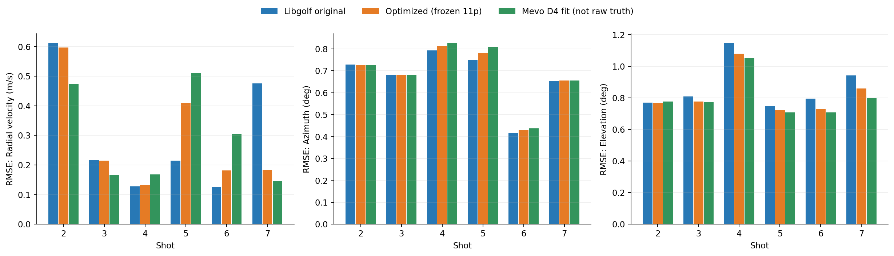
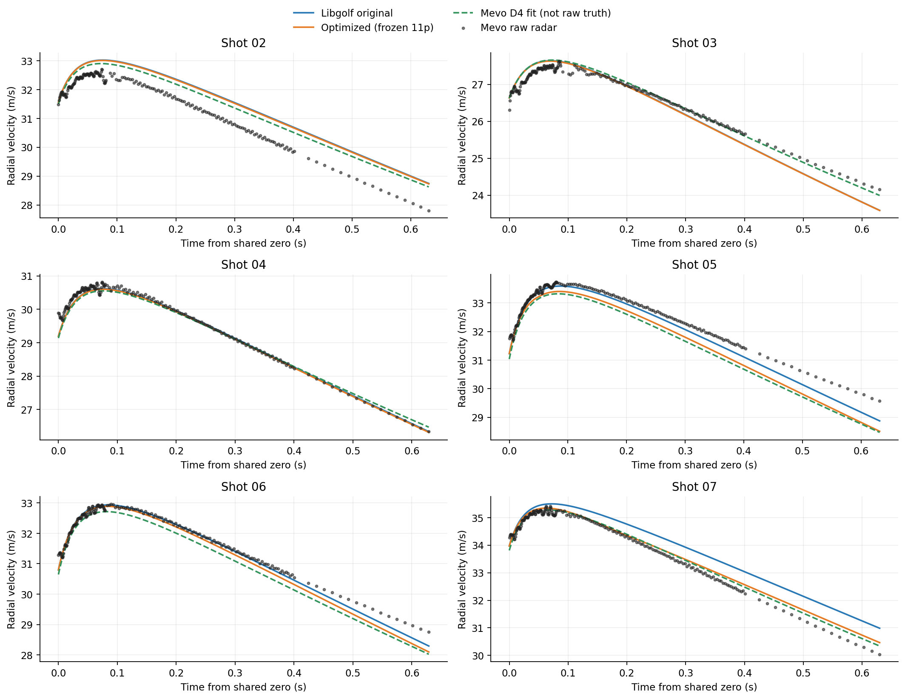
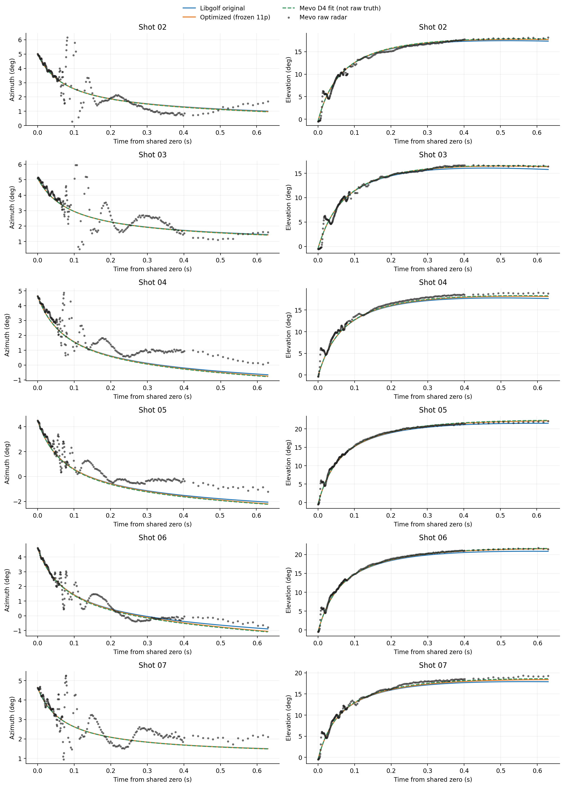
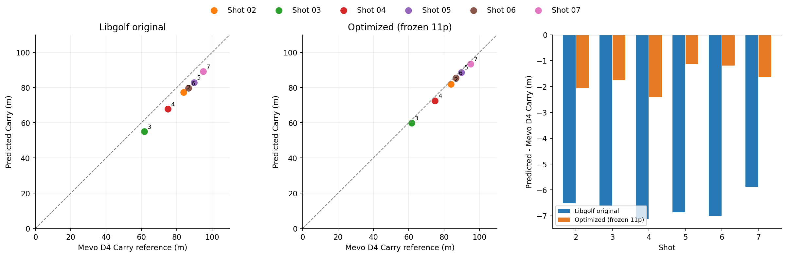
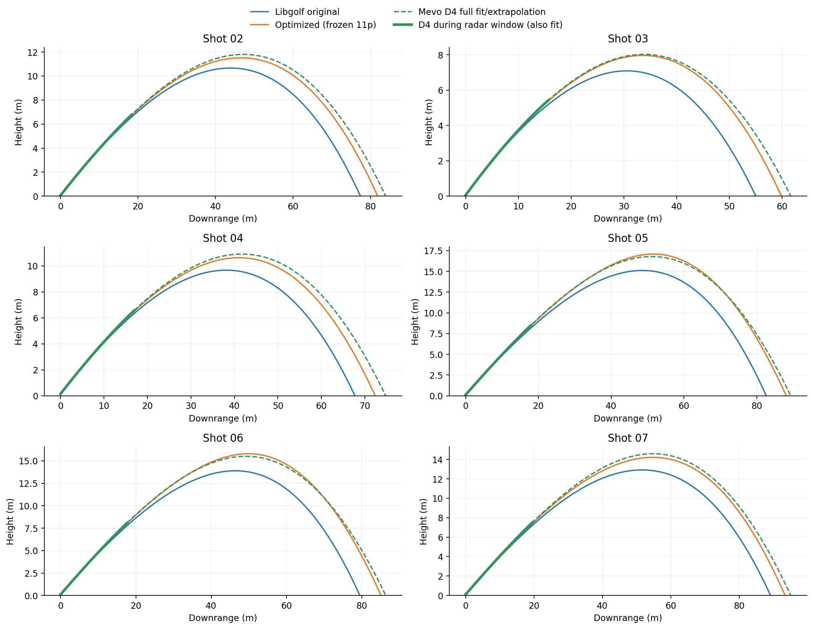
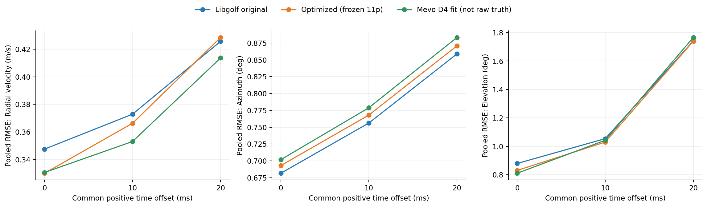

# Mevo+ 实测数据与 Libgolf 模型评估：默认环境、统一击球时刻

数据：`2026-09-19_091358Z`，**仅 Shot 02–07，共 6 杆**；原始 Libgolf 与冻结的 `filtered_665` 11 参数优化模型。未重新拟合参数。

## 1. 数据与统一设置

| Shot | 球速 (m/s) | 发射仰角 (°) | 发射方向 (°) | 总转速 (rpm) | D4 Carry (m) | 雷达窗口 (s) | 雷达点数 |
| --- | --- | --- | --- | --- | --- | --- | --- |
| 2 | 34.315 | 22.210 | 0.720 | 3187.959 | 83.918 | 0.631 | 204 |
| 3 | 28.911 | 22.039 | 0.988 | 4293.042 | 61.631 | 0.630 | 209 |
| 4 | 31.995 | 23.148 | -0.948 | 3909.638 | 74.912 | 0.629 | 204 |
| 5 | 35.233 | 26.298 | -2.380 | 5286.572 | 89.764 | 0.631 | 207 |
| 6 | 34.525 | 25.813 | -0.993 | 5129.468 | 86.649 | 0.629 | 204 |
| 7 | 36.847 | 22.015 | 1.176 | 4485.028 | 95.029 | 0.630 | 205 |

按用户要求，因 Shot 01 的优化模型 Carry 相对误差为 10.58%，将其从两模型的全部评估、图表和汇总中排除，原始文件保留。**这是查看误差后的子集选择，不代表已证实 Shot 01 测量无效；结果仅适用于保留的 6 杆，不能解释为原始 7 杆的无偏性能。**

保留 1,233 个球雷达点；每杆首点用于视线锚定，不计入评分，共 **1,227 个评分点**，无其他删点。每杆实测约 0.63 s；`dist_m` 全为 0，不计算“实测三维位置 RMSE”。球雷达分页完整；`radarComplete=false` 涉及杆头分页失败，不等于球数据不完整。相机缺少有效标定，本报告不将其转换为三维真值。

| 设置 | 本次统一取值 |
| --- | --- |
| 温度 | 59 °F = 15 °C |
| 相对湿度 | 0% |
| 气压 | 29.92 inHg ≈ 1013.21 hPa |
| 海拔 | 0 ft = 0 m |
| 风速 | 0 mph = 0 m/s |
| 主结果击球时刻 / 雷达偏移 | 全部 `t₀=0 s`、`Δt=0 s`，`t_model=n` |
| 击球初始条件 | 每杆 final D4 的球速、发射仰角/方向、后旋/侧旋、起点；两模型完全相同 |
| 积分 / 落地 | 原库默认步长 0.01 s；首次穿越平地 Y=0 时线性插值，不含弹跳滚动 |

这里“统一”指同一杆的两模型共用同一套击球输入，并且所有杆采用同一个时间偏移，不是把不同杆的球速强行设成同值。环境直接使用 `AtmosphericData{}`，不是当日天气估计。输入取自同批观测解算出的 final D4，**这是给定初始条件的回放，不是仅使用击球瞬间已知信息的独立盲测**。总转速为后旋与侧旋平方和开根号，可能与设备整数总转速有舍入差。

**时间与坐标假设：** `n=0` 实际是首个球雷达点，暂作为击球时刻；没有独立证据证明两者严格重合。使用 `n`，不使用会回绕的设备 `time_tick`，也不把主机接收时间当击球时间。D4 的 `[前进, 高度, 侧向]` 对应 Libgolf 的 `[y,z,x]`；侧旋符号转换为 `libgolf_sidespin=-Mevo_sidespin`，保持侧向弯曲约定一致。侧旋转换全杆固定，不按残差选符号。

完整雷达外参缺失：假定雷达角度轴与 D4 轴同向，使用 `rangeMm=2438` 作为首点斜距估计，雷达位置取 `p_radar=p_start−2.438·u(az₀,el₀)`。各杆仅按同一规则建立原点，两模型共用，不拟合旋转、距离或角度偏置。`heightMm` 不当作传感器绝对高度。**所以角度/径向速度误差包含时间及外参假设误差，不是纯气动误差。**

## 2. 模型

| 模型 | 本次使用版本 |
| --- | --- |
| Libgolf 原始 | `DefaultAerodynamicModel`；原库阻力、Magnus 升力及自旋衰减 |
| 11 参数优化 | 原库基础上的分段阻力修正（Re、S）和全局升力修正（S），保留原自旋衰减；复用既有实现与冻结系数 |

优化系数来自 MyGolfSpy 1,640 条记录中、9 个来源构成的 `filtered_665` 聚合子集，以 Carry 为主并约束最高点误差。**本次 6 杆球速 28.91–36.85 m/s，全部低于该子集 39.47–71.93 m/s 的球速范围，是低速域外评估，不是原优化域的重复验证。**

## 3. 与早期雷达实测对比

比较视线径向速度、方位角、仰角。预测先投影到雷达视线：`v_r=(p−p_radar)·v/|p−p_radar|`，不能直接把球速模长与径向速度相减。角度误差折返到 ±180°；误差统一定义为预测减观测。

### 3.1 汇总误差

点加权 RMSE（每模型 1,227 点）：

| 模型 | 径向速度 RMSE (m/s) | 方位角 RMSE (°) | 仰角 RMSE (°) |
| --- | --- | --- | --- |
| Libgolf 原始 | 0.348 | 0.682 | 0.880 |
| 11 参数优化 | 0.330 | 0.693 | 0.831 |
| Mevo D4 内部一致性参照 | 0.331 | 0.702 | 0.811 |

逐杆 RMSE 的算术平均（每杆等权，6 杆）：

| 模型 | 径向速度 RMSE (m/s) | 方位角 RMSE (°) | 仰角 RMSE (°) |
| --- | --- | --- | --- |
| Libgolf 原始 | 0.295 | 0.671 | 0.869 |
| 11 参数优化 | 0.287 | 0.681 | 0.822 |
| Mevo D4 内部一致性参照 | 0.295 | 0.690 | 0.803 |

Mevo D4 一行是将设备自己的拟合轨迹投影回同一雷达坐标的内部一致性参照，**不是第三套独立真值，也不是被评估的 Libgolf 模型**。1,227 个点在杆内高度相关，独立击球样本数只有 6，不给出虚假的大样本置信结论。



### 3.2 径向速度与角度曲线

黑点为原始雷达观测；蓝/橙线为两个模型；绿色虚线为 D4 拟合参照。所有曲线用同一时间与几何口径。





| Shot | 模型 | 径向速度 RMSE (m/s) | 方位角 RMSE (°) | 仰角 RMSE (°) |
| --- | --- | --- | --- | --- |
| 2 | Libgolf 原始 | 0.613 | 0.729 | 0.770 |
| 2 | 11 参数优化 | 0.596 | 0.727 | 0.767 |
| 3 | Libgolf 原始 | 0.217 | 0.681 | 0.809 |
| 3 | 11 参数优化 | 0.215 | 0.682 | 0.776 |
| 4 | Libgolf 原始 | 0.127 | 0.793 | 1.149 |
| 4 | 11 参数优化 | 0.133 | 0.814 | 1.080 |
| 5 | Libgolf 原始 | 0.214 | 0.749 | 0.749 |
| 5 | 11 参数优化 | 0.410 | 0.781 | 0.722 |
| 6 | Libgolf 原始 | 0.125 | 0.418 | 0.795 |
| 6 | 11 参数优化 | 0.182 | 0.429 | 0.728 |
| 7 | Libgolf 原始 | 0.476 | 0.655 | 0.942 |
| 7 | 11 参数优化 | 0.184 | 0.655 | 0.859 |

## 4. 与 Mevo D4 完整飞行结果对比

**本节是与设备拟合/外推结果的一致性对比，不等于实测落点精度。** Carry 采用 D4 原点到落点的水平距离 `hypot(X,Z)`；最高点与飞行时间分别取全程最大高度及首次落地时刻。D4 全程曲线为多项式，Carry 等表格参照值直接取最终 D4 摘要。

### 4.1 结果对比

| 模型 | Carry RMSE (m) | Carry MAE (m) | Carry 偏差 (m) | Carry MAPE (%) | 最高点 RMSE (m) | 飞行时间 RMSE (s) |
| --- | --- | --- | --- | --- | --- | --- |
| Libgolf 原始 | 6.680 | 6.668 | -6.668 | 8.321 | 1.404 | 0.291 |
| 11 参数优化 | 1.760 | 1.701 | -1.701 | 2.151 | 0.283 | 0.120 |

| Shot | Mevo D4 Carry (m) | Libgolf 原始 Carry (m) | Libgolf 原始 误差 (m) | 11 参数优化 Carry (m) | 11 参数优化 误差 (m) |
| --- | --- | --- | --- | --- | --- |
| 2 | 83.918 | 77.402 | -6.516 | 81.852 | -2.066 |
| 3 | 61.631 | 55.022 | -6.609 | 59.874 | -1.757 |
| 4 | 74.912 | 67.783 | -7.129 | 72.496 | -2.416 |
| 5 | 89.764 | 82.897 | -6.867 | 88.619 | -1.145 |
| 6 | 86.649 | 79.645 | -7.004 | 85.457 | -1.192 |
| 7 | 95.029 | 89.148 | -5.881 | 93.396 | -1.633 |





### 4.2 各 Shot 的 D4 轨迹公式

以下直接使用各杆 `summary.json → flight → polyX / polyY / polyZ` 的最终 D4 四次多项式，并非本次重新拟合。系数数组按常数项、一次项至四次项排列，已解码为物理单位，**不再除以 `polyScale`**。

`t` 单位为秒；`X(t)` 为前进距离、`Y(t)` 为竖直高度、`Z(t)` 为侧向位置，单位均为米，坐标原点沿用 D4。常数项保留多项式原值，不强制替换为摘要中经过舍入的 `startPositionM`。系数仅在下列展示中保留 9 位小数，实际计算使用原始完整精度。

`t=0` 是 D4 模型的时间零点；本报告主对比假定 `t=n`，并非已独立确认真实撞击同步。各式仅在所列 D4 飞行时间内用于绘图，不应继续向外延长；雷达窗口后的曲线属于设备拟合／外推参考。摘要时间和系数存在量化、舍入，区间终点的 `Y(t)` 可能不严格等于 0。Shot 01 已排除，不在此列出。

#### Shot 02

绘制区间：`0 ≤ t ≤ 3.675 s`；原始雷达窗口：`0 ≤ n ≤ 0.63061 s`。

$$
\begin{aligned}
X(t) &= 31.695996006t - 3.928771226t^{2} + 0.538395708t^{3} - 0.034120714t^{4} \\
Y(t) &= 0.065214463 + 12.988692462t - 3.532436866t^{2} - 0.066823033t^{3} + 0.017670505t^{4} \\
Z(t) &= 0.214557960 + 0.390890578t - 0.298980182t^{2} + 0.050919579t^{3} - 0.003763897t^{4}
\end{aligned}
$$

#### Shot 03

绘制区间：`0 ≤ t ≤ 2.997 s`；原始雷达窗口：`0 ≤ n ≤ 0.62976 s`。

$$
\begin{aligned}
X(t) &= 26.785482305t - 3.331529782t^{2} + 0.544179194t^{3} - 0.041818730t^{4} \\
Y(t) &= 0.049198112 + 10.857943550t - 3.705641678t^{2} - 0.018716309t^{3} + 0.014845816t^{4} \\
Z(t) &= 0.219191750 + 0.459939063t - 0.167897680t^{2} + 0.029845649t^{3} - 0.002484347t^{4}
\end{aligned}
$$

#### Shot 04

绘制区间：`0 ≤ t ≤ 3.498 s`；原始雷达窗口：`0 ≤ n ≤ 0.62890 s`。

$$
\begin{aligned}
X(t) &= 29.361402891t - 3.776375768t^{2} + 0.562095821t^{3} - 0.038522238t^{4} \\
Y(t) &= 0.146814648 + 12.602621979t - 3.668619204t^{2} - 0.040871155t^{3} + 0.016075400t^{4} \\
Z(t) &= 0.193741604 - 0.501970888t - 0.424706202t^{2} + 0.078923609t^{3} - 0.006276012t^{4}
\end{aligned}
$$

#### Shot 05

绘制区间：`0 ≤ t ≤ 4.339 s`；原始雷达窗口：`0 ≤ n ≤ 0.63146 s`。

$$
\begin{aligned}
X(t) &= 31.369436842t - 4.757358073t^{2} + 0.731854791t^{3} - 0.047971579t^{4} \\
Y(t) &= 0.106357783 + 15.661963878t - 3.563205320t^{2} - 0.095174610t^{3} + 0.019166673t^{4} \\
Z(t) &= 0.184310619 - 1.353407104t - 0.390995428t^{2} + 0.074682581t^{3} - 0.005411213t^{4}
\end{aligned}
$$

#### Shot 06

绘制区间：`0 ≤ t ≤ 4.166 s`；原始雷达窗口：`0 ≤ n ≤ 0.62890 s`。

$$
\begin{aligned}
X(t) &= 30.929280042t - 4.566710741t^{2} + 0.704183968t^{3} - 0.047043541t^{4} \\
Y(t) &= 0.099128566 + 15.071268954t - 3.592134666t^{2} - 0.085620172t^{3} + 0.018774115t^{4} \\
Z(t) &= 0.198156611 - 0.585678165t - 0.614133166t^{2} + 0.112582833t^{3} - 0.008188545t^{4}
\end{aligned}
$$

#### Shot 07

绘制区间：`0 ≤ t ≤ 4.177 s`；原始雷达窗口：`0 ≤ n ≤ 0.62976 s`。

$$
\begin{aligned}
X(t) &= 33.994628865t - 4.812078255t^{2} + 0.689995411t^{3} - 0.043682967t^{4} \\
Y(t) &= 0.087884351 + 13.885455442t - 3.138204749t^{2} - 0.135604168t^{3} + 0.021493040t^{4} \\
Z(t) &= 0.199862322 + 0.693471351t - 0.168680842t^{2} + 0.026541227t^{3} - 0.001793211t^{4}
\end{aligned}
$$

## 5. 稳健性检查

### 5.1 统一时间偏移

固定几何及击球输入，所有杆、两模型统一测试 `t_model=n+Δt`，Δt 为 0 / 10 / 20 ms；**只做敏感性检查，不为每杆或每个模型寻找最优偏移**。10/20 ms 不是已确认的真实延迟，也未随偏移重新锚定首点。

| 模型 | 共同偏移 (s) | 径向速度 RMSE (m/s) | 方位角 RMSE (°) | 仰角 RMSE (°) |
| --- | --- | --- | --- | --- |
| Libgolf 原始 | 0.000 | 0.348 | 0.682 | 0.880 |
| Libgolf 原始 | 0.010 | 0.373 | 0.756 | 1.054 |
| Libgolf 原始 | 0.020 | 0.426 | 0.859 | 1.741 |
| 11 参数优化 | 0.000 | 0.330 | 0.693 | 0.831 |
| 11 参数优化 | 0.010 | 0.366 | 0.768 | 1.030 |
| 11 参数优化 | 0.020 | 0.429 | 0.871 | 1.739 |



### 5.2 共同子集与数值步长

Shot 01 已排除；主结果保留 Shot 02–07 的全部非锚定点，不再按 SNR 删点。以下仅检查共同 SNR 掩码下结果是否变化。SNR 是原始整数，20 仅是检查门限，不宣称为设备质量合格线。

| 敏感性口径 | 模型 | 点数 | 径向速度 RMSE (m/s) | 方位角 RMSE (°) | 仰角 RMSE (°) |
| --- | --- | --- | --- | --- | --- |
| Shot 02–07，SNR ≥ 20（原始分值，非 dB） | Libgolf 原始 | 1029 | 0.296 | 0.678 | 0.912 |
| Shot 02–07，SNR ≥ 20（原始分值，非 dB） | 11 参数优化 | 1029 | 0.282 | 0.682 | 0.889 |

将步长从 0.01 s 改为 0.001 s，12 条轨迹的最大 Carry 差为 0.1242 m、最高点差 0.0243 m、飞行时间差 0.00533 s；雷达采样时刻最大预测径向速度差 0.02295 m/s、方位角差 0.00214°、仰角差 0.00427°。细步长下原始/优化的径向速度 RMSE 为 0.3480/0.3274 m/s。主报告保留原库默认步长结果。

## 6. 结论

- 仅 Shot 02–07，默认环境、统一零偏移下，径向速度 RMSE：原始 **0.348**、优化 **0.330 m/s**；该指标优化模型更低，但仅 3/6 杆改善，20 ms 共同偏移下总体排名轻微反转。方位角 RMSE 以原始模型更低，仰角以优化模型更低，不能概括为全面优于原模型。
- 对 Mevo D4 的 Carry 参考，原始/优化 RMSE 为 **6.680 / 1.760 m**，MAPE 为 **8.32% / 2.15%**；优化模型更接近该设备参考，但这不是独立落点验证。
- 这批数据可以做**低速域外的条件性回放评估**；目前不足以据此重拟合全部 11 个气动参数。修正前应先确认真实击球同步、雷达外参和现场环境，再补充独立 Carry/轨迹与更多球速工况；不要让气动系数吸收时序、坐标或设备外推偏差。

## 7. 复现与结果文件

需要 `g++`、`numpy`、`pandas`、`matplotlib`。在具备依赖的 Python 环境、仓库根目录运行：

```bash
python3 ironsight/mevo_data/2026-09-19_091358Z/libgolf_default_evaluation/evaluate_mevo_models.py
```

本次使用已有环境 `/home/mingruz/miniconda3/envs/rl_wsl_metadrive/bin/python`，默认 `python3` 环境缺少 pandas；详细软件版本与源文件校验值保存在 manifest。

| 文件 | 内容 |
| --- | --- |
| [initial_conditions.csv](outputs/initial_conditions.csv) | Shot 02–07 的 6 杆输入、环境、时间、坐标转换及雷达原点 |
| [radar_comparison.csv](outputs/radar_comparison.csv) | 零偏移逐点观测/预测/误差及评分掩码；3 组 × 1,233 行 |
| [overall_metrics.csv](outputs/overall_metrics.csv) / [radar_metrics_by_shot.csv](outputs/radar_metrics_by_shot.csv) | 雷达汇总及逐杆指标 |
| [trajectories.csv](outputs/trajectories.csv) | 两模型共 12 条完整预测轨迹 |
| [mevo_summary_comparison.csv](outputs/mevo_summary_comparison.csv) / [mevo_summary_metrics.csv](outputs/mevo_summary_metrics.csv) | D4 Carry / 最高点 / 飞行时间对比 |
| [time_offset_sensitivity.csv](outputs/time_offset_sensitivity.csv) / [snr20_sensitivity.csv](outputs/snr20_sensitivity.csv) | 时间与共同子集敏感性；旧兼容文件 shots_2_to_7_sensitivity.csv 现与主评估同口径 |
| [data_quality.csv](outputs/data_quality.csv) / [numerical_convergence.csv](outputs/numerical_convergence.csv) / [radar_metrics_dt_0p001.csv](outputs/radar_metrics_dt_0p001.csv) | 数据检查及步长检查 |
| [run_manifest.json](outputs/run_manifest.json) / [calibration.csv](outputs/calibration.csv) | 环境、假设、软件版本、源文件 SHA-256 与本次冻结系数 |

图片使用 `figures/` 相对路径；整个 `libgolf_default_evaluation` 文件夹可移动阅读。复算脚本仍需仓库模型源代码。本报告及其派生 CSV、图片已按 Shot 02–07 更新；原始测量文件（含 Shot 01）、已有模型参数和其他报告未修改。
